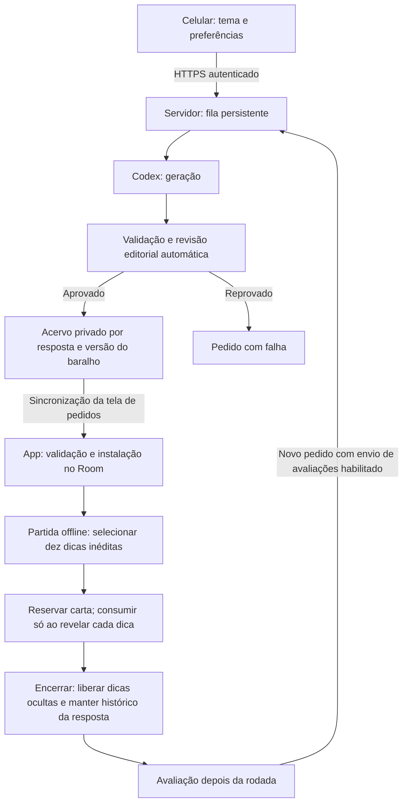

# Plano de testes — baralhos, dicas inéditas e geração automática

Data: 2026-09-12. Estado: **fábrica implementada e testada localmente; ativação e geração real pendentes**.
Base inspecionada: `main`, HEAD `1bd3be3`, incluindo alterações locais da
reestruturação. Este plano não significa que os cenários abaixo foram executados.

## 1. O que está estruturado



| Parte | Responsabilidade e fonte no código |
|---|---|
| Pedido no celular | `presentation/fabrica/FabricaScreen.kt` e `FabricaViewModel.kt` |
| Transporte | `data/fabrica/ServicoDaFabrica.kt`: conexão, envio, consulta e download |
| Fila e criação | `fabrica/server.py`: SQLite, dono do pedido, Codex e revisão |
| Entrada de conteúdo | `ParserDoCatalogo` e `InstaladorDeBaralhos`: validar antes de persistir |
| Seleção | `SelecionadorDeDicas`: resposta canônica, ids e textos normalizados |
| Histórico e restauração | `RepositorioDeCardsLocal` e `HistoricoDeDicasDao`, Room v6 |
| Acervo e variedade | `AcervoDeRespostas` e `RotacaoDeRespostas`: banco compartilhado, aliases e última aparição |
| Avaliações | `RegistroDeFeedback` e `ContextoDeFeedback`: versão, carta e dicas reveladas |

As regras vigentes pertencem a [GAME_RULES.md](GAME_RULES.md); o formato,
a [CATALOG_FORMAT.md](CATALOG_FORMAT.md); a régua editorial, a
[CARDS_GUIDE.md](CARDS_GUIDE.md); ativação do serviço, a
[DECK_STUDIO.md](DECK_STUDIO.md). Este arquivo é dono dos cenários de teste.

## 2. Evidência disponível e lacunas

Evidência atual em `HANDOFF_ACTIVE.md`. Os testes abaixo foram executados;
os cenários completos das tabelas posteriores continuam sendo critérios de
aceitação, não uma declaração de homologação integral.

| Área | Evidência disponível | O que ainda não comprova |
|---|---|---|
| JVM | 270 testes por variante, incluindo nove do repositório da fábrica, zero falhas/erros | HTTPS real, interface completa conectada e subprocesso Codex |
| Python | 17 testes, também com `-O`; HTTP loopback autenticado, concorrência, limite e ampliação 480→500 | TLS real, subprocesso Codex real e qualidade factual |
| Build/lint | APK e relatórios locais presentes; sucesso registrado no handoff | Usabilidade, TalkBack, desempenho ou migração num dispositivo |
| Android | 23 instrumentados: migração, Room, reabertura do DataStore e ampliação durante partida | HTTPS do celular ao host, processo Android morto e UI conectada completa |
| Fluxo completo | Código de ponta a ponta preparado | Serviço ativado e baralho realmente pedido, recebido e jogado no celular |

Não há medição de cobertura de linhas/ramos; os totais incluem o jogo
anterior, não são testes exclusivos da fábrica. `RepositorioDaFabricaTest`
cobre retentativa, snapshot de avaliações, cache, falha parcial, cancelamento
e versões. `FabricaPersistenciaTest` cobre DataStore real e instalação no Room.
O HTTP real é local e usa geração simulada. TLS, UI conectada completa e uma
geração real continuam pendentes.
Os fakes antigos de `RepositorioDeCards` podem usar os métodos padrão que
devolvem conteúdo sem consumo: esses testes não provam o histórico no Room.
`ConceitoDePartidaRoomTest` cobre transações, reservas, fechamento/reabertura
do banco e migração 5→6. Os testes de ViewModel simulam SavedState atrasado
contra checkpoint persistido. Isso não equivale a matar o processo Android
durante uma partida real; esse cenário continua na validação manual.

## 3. Preparação e dados de teste

- Usar emulador e/ou instalação de teste, sem apagar dados pessoais. Registrar
  modelo, API, versão do APK, branch/HEAD e referência do diff sem commit.
- Ambientes: Android API 26 para compatibilidade mínima, API 35 e aparelho
  Fold disponível para validação física. Não presumir que já estão conectados.
- Criar dois donos fictícios A/B, com credenciais de teste distintas, e dois
  históricos Android independentes. Não publicar tokens nas evidências.
- Preparar um baralho determinístico com dez respostas e exatamente 60 dicas
  distintas por resposta, incluindo uma identidade como `personagem-harry-potter`.
  Nos testes mecânicos, textos sintéticos bastam; para qualidade, usar fatos
  reais revisados e fontes registradas no material privado de curadoria.
- Variantes: banco legado de dez dicas; banco com nove livres; duas edições
  compartilhando resposta; atualização 60→120; correção mantendo id; JSON
  inválido; resposta contendo caracteres acentuados; versão antiga/finalizada.
- Separar acervo editorial completo da carta de dez dicas e do histórico de
  chaves: uma dica pode gerar mais de uma chave. Não contar linhas de
  `dicas_utilizadas` como se fossem quantidade de dicas.

## 4. Ordem de execução e critérios

P0 bloqueia a homologação: repetição, perda/corrupção de dados, vazamento,
quebra do jogo ou geração/recebimento sem funcionamento. P1 cobre recuperação,
clareza e condições de borda. Casos pendentes não contam como aprovados.

### Etapa A — seleção e persistência, sem servidor real

| ID | Prioridade / tipo | Cenário | Resultado esperado |
|---|---|---|---|
| D01 | P0 · JVM + Room | Preparar seis cartas da mesma resposta, entre partidas, revelando as dez em todas | Dez por carta; união de 60 textos/ids; interseção vazia entre cartas |
| D02 | P0 · JVM + UI | Tentar sétima utilização; repetir com apenas nove dicas livres | Resposta indisponível; nenhuma dica antiga usada para completar dez |
| D03 | P0 · Room | Abrir turno com banco de 60, revelar três dicas, acertar, queimar ou abandonar | Só três consumidas; 57 livres, incluindo as sete ocultas; próxima carta não inclui as três vistas |
| D04 | P0 · Room + aparelho | Reabrir banco e restaurar a mesma sessão/rodada; repetir após morte de processo | Mesma resposta, dez dicas, grid, rodada, pontos e fase; nenhum consumo extra |
| D05 | P0 · Room | Falha no checkpoint/consumo; dois pedidos simultâneos da mesma rodada | Rollback sem estado parcial ou aparição extra; carta idempotente; reservas exclusivas até fim/abandono |
| D06 | P0 · integração | Atualizar baralho enquanto há partida salva; restaurar e depois iniciar outra | Partida salva mantém conteúdo; partida nova usa versão atual e histórico preservado |
| D07 | P0 · JVM + Room | Trocar id de edição, ordem, caixa/acentos/pontuação; corrigir texto mantendo id | Essas mudanças não reiniciam o histórico da dica correspondente |
| D08 | P0 · instalação | Upgrades Room 4→5→6 e 5→6 com conteúdo, feedback e histórico | Conteúdo preservado; consumo v5 conservado; novas tabelas e defaults coerentes com schema |
| D09 | P1 · Room + UI | Selecionar duas edições da mesma resposta; remover/reinstalar apenas conteúdo | Contador e monte sem duplicidade; histórico sobrevive à troca do conteúdo |
| D10 | P0 · regressão | Acerto, queima, grupos, Shot, fim e Jogar de novo; alternar offline | Pontuação e rodízios preservados; nova sessão sem reciclagem; jogo independe da fábrica |
| D11 | P0 · JVM + Room | 40 respostas elegíveis; quatro partidas completas de dez rodadas | As 40 aparecem antes da primeira repetição; ciclo seguinte começa pelas mais antigas |
| D12 | P0 · JVM + Room | Mesmo id/nome em temas e baralhos diferentes, incluindo aliases transitivos | Uma resposta no monte; banco e históricos compartilhados, inclusive com conteúdo instalado não selecionado |
| D13 | P0 · Room | Montar sessão, reservar carta e abandonar antes de abrir o grid | Nenhuma dica usada nem aparição registrada; nova sessão libera reservas antigas |
| D14 | P0 · ViewModel | Banco falha ou demora ao revelar; toque duplicado; retentativa | Texto só aparece após sucesso; um consumo; falha restaura o último checkpoint |

### Etapa B — fila e contrato HTTP com geração simulada

| ID | Prioridade / tipo | Cenário | Resultado esperado |
|---|---|---|---|
| S01 | P0 · HTTP + ViewModel | POST aceito no servidor, resposta perdida; reenviar e recriar a tela | Mesmo id de tentativa, apenas um trabalho na fila; pedido continua consultável |
| S02 | P0 · HTTP | Sem token, token inválido, dono B consultando pedido/resultado/base de A | Negação sem conteúdo privado; não confiar em dono declarado no corpo |
| S03 | P0 · transporte | HTTP simples, certificado inválido e redirecionamento para outro host | Conexão recusada; credencial não enviada ao destino do redirecionamento |
| S04 | P0 · integração | JSON inválido, ids em conflito, versão divergente/antiga e estado técnico desconhecido | Conteúdo não autorizado não entra no Room; nenhuma gravação parcial ou downgrade |
| S05 | P1 · fila | Limite de três pendentes, corpo excessivo/malformado e valores fora do contrato | Recusa controlada; serviço continua atendendo pedidos válidos |
| S06 | P0 · subprocesso simulado | Codex ausente, timeout, saída inválida, revisão reprovada e serviço interrompido | Pedido falha sem entrega; sem reexecutar silenciosamente; fila seguinte consegue avançar |
| S07 | P1 · ViewModel + HTTP | Um resultado inválido junto com outro válido | Falha identificável e possibilidade de obter o válido; verificar bloqueio global de sincronização |
| S08 | P1 · integração | 21 ou mais pedidos; pedido antigo só fica pronto depois dos novos | Resultado antigo recuperável; a listagem não corta mais em vinte |
| S09 | P1 · transporte + UI | Consultas periódicas, saída da tela, conexão lenta e versão já instalada | Sem download repetido; consulta periódica suspensa fora da tela; UI continua responsiva |
| S10 | P0 · operação | Inicialização com configuração inválida ou Python otimizado (`-O`) | Validações explícitas permanecem ativas, sem depender de `assert` |

### Etapa C — feedback e qualidade editorial

| ID | Prioridade / tipo | Cenário | Resultado esperado |
|---|---|---|---|
| F01 | P0 · integração | Avaliar, avançar, atualizar/remover conteúdo e exportar | Voto/comentário associados à versão e dicas daquela rodada; contexto não depende do texto atual |
| F02 | P0 · contrato | Pedir ampliação com envio de avaliações ligado e desligado | Contexto enviado somente quando habilitado; isolamento do dono mantido |
| F03 | P0 · integração | Ampliar 60→120 após seis cartas com as dez dicas reveladas; usar mais seis vezes | Ids anteriores preservados; somente os 60 fatos novos permitem novas cartas |
| F04 | P1 · fila + UI | Ampliar acervo de 480 ou 500 dicas | Limite comunicado e sem promessa impossível de acrescentar 60; fluxo atual precisa ser avaliado |
| F05 | P0 · editorial humana | Revisar um acervo completo, não apenas dez dicas sorteadas | Nenhum erro factual conhecido, resposta explícita ou paráfrase do mesmo fato no acervo aprovado |
| F06 | P1 · sessão com jogadores | Jogar dez respostas com dicas em ordem aleatória | Dicas autossuficientes; registrar dificuldade, ambiguidades e sugestões por id, sem supor curva fixa |
| F07 | P1 · recuperação | Morrer o processo durante comentário/salvamento ou falhar a escrita do feedback | Registrar se há perda/duplicação; mensagem clara; avaliar impacto sobre a continuação do jogo |

### Etapa D — celular e gerador reais

| ID | Prioridade / tipo | Cenário | Resultado esperado |
|---|---|---|---|
| E01 | P0 · ponta a ponta | Pedido no celular → Codex real → revisão → recebimento → partida | Baralho chega sem copiar prompt/importar arquivo; dez respostas jogáveis e acervos válidos |
| E02 | P0 · ponta a ponta | Fechar app durante geração e voltar após conclusão | Serviço continua; resultado instala ao sincronizar a tela; não exigir push inexistente |
| E03 | P0 · dois aparelhos | Jogar no A e depois usar a mesma resposta no B | Histórico A preservado; B segue seu histórico local, sem promessa de sincronização entre aparelhos |
| E04 | P1 · UX física | Tela estreita/Fold aberto e fechado, teclado, fonte ampliada, claro/escuro e TalkBack | Campos e ações acessíveis; leitura e estados compreensíveis; sem resposta secreta na biblioteca |
| E05 | P1 · desempenho | Acervos de 30 respostas × 500 dicas, histórico longo e conexão lenta | Medir tempo, memória e banco; sem ANR/OOM ou bloqueio perceptível do jogo offline |

## 5. Roteiro de aceitação: Harry Potter sem dicas repetidas

1. Na instalação de teste, carregar o baralho de dez respostas com 60 dicas
   por resposta. Registrar versão e ids; guardar a lista de dicas fora da UI
   de jogadores, apenas na evidência de teste.
2. Selecionar só esse baralho e configurar dez rodadas. Jogar seis partidas,
   revelando as dez dicas em todas as rodadas. A resposta de referência aparecerá uma vez
   em cada partida, pois a seleção elimina respostas duplicadas na partida.
3. Comparar as seis cartas preparadas da resposta: devem conter 60 dicas
   distintas. As dicas não precisam aparecer em ordem numérica no acervo.
4. Na sétima tentativa, verificar esgotamento. O app não pode reutilizar
   dicas para completar a partida. Conferir mensagem e ação para obter conteúdo.
5. Enviar uma avaliação identificando uma dica e pedir mais dicas para a
   mesma edição. Esperar revisão e atualização automática para 120.
6. Jogar outras seis partidas. Cada resposta tem mais 60 dicas disponíveis,
   sem reciclar as usadas. Conferir a correção solicitada e a variedade real.
7. Em execução separada, interromper uma rodada após duas dicas e restaurar:
   deve voltar ao mesmo ponto, sem trocar carta nem consumir outro lote.
8. Em banco novo com 60 dicas por resposta, acertar na terceira: conferir
   57 dicas livres, incluindo as sete ocultas. Ao repetir depois do rodízio,
   as três vistas não entram na carta nova.

Esse teste diferencia a propriedade matemática do seletor, já parcialmente
coberta, da experiência real com catálogo, banco, servidor, UI e conteúdo.

## 6. Comandos e evidências a coletar na execução

Rodar a partir da raiz, usando o cache Gradle já disponível neste ambiente:

```powershell
.\gradlew.bat -g C:/Users/Felipe/.gradle test assembleDebug assembleDebugAndroidTest lintDebug --offline
python -m unittest discover -s fabrica -v
```

Com dispositivo de teste conectado, executar separadamente:

```powershell
.\gradlew.bat -g C:/Users/Felipe/.gradle connectedDebugAndroidTest --offline
```

O comando instrumentado instala/executa APKs no alvo selecionado. Confirmar o
alvo de teste antes; não usar limpeza de dados do aparelho pessoal como preparo.
Morte de processo deve seguir [SUPPORT_RUNBOOK.md](SUPPORT_RUNBOOK.md) e a
semântica Android: retornar com a task preservada; swipe nos recentes não é
o mesmo cenário. Não iniciar o Codex real como parte da suíte simulada.

Para cada caso: id, versão/ambiente, dados usados, passos, esperado, observado,
aprovado/falhou/bloqueado, evidência local e eventual defeito. Capturas não
devem conter tokens ou conteúdo privado. Duração da geração, tamanho do JSON,
latência de download e tamanho do banco são medições, não estimativas.

## 7. Critério para considerar pronto

- Todos os P0 executados e aprovados, com zero repetição detectada, zero
  perda de dados e zero acesso cruzado nos cenários planejados.
- Seis utilizações + esgotamento + ampliação comprovados no Android real,
  além dos testes puros; uma rodada restaurada mantém o mesmo conteúdo.
- Fluxo completo com Codex real executado e um acervo integral revisado por
  pessoa responsável. Aprovação de outro modelo não substitui essa revisão.
- Todos os fluxos principais navegáveis no celular estreito e no Fold; P1
  restantes registrados com impacto e aceitação explícita, sem ocultar lacunas.
- Host, HTTPS e conta isolada provisionados antes de testar geração real.
  Essa definição permanece pendente; não bloqueia as etapas A e B simuladas.

Próxima execução recomendada: A → B → C → D. Sem percentual de cobertura
inventado e sem declarar produto homologado apenas porque o APK compila.
